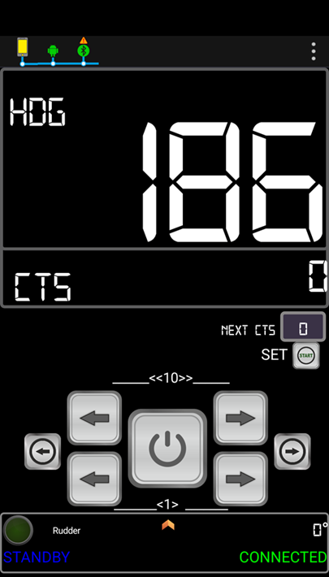
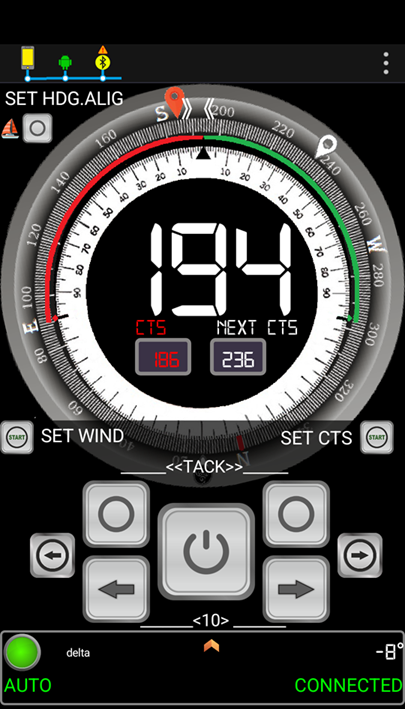
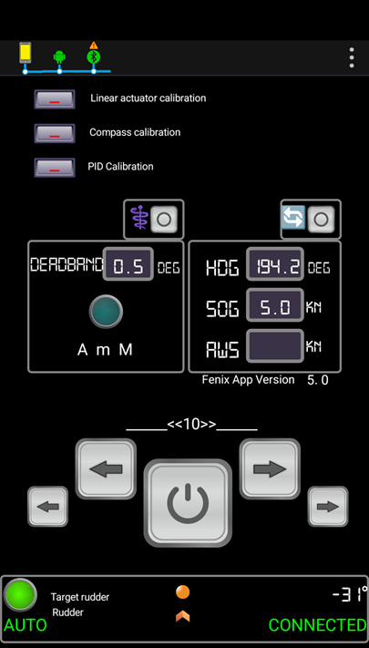
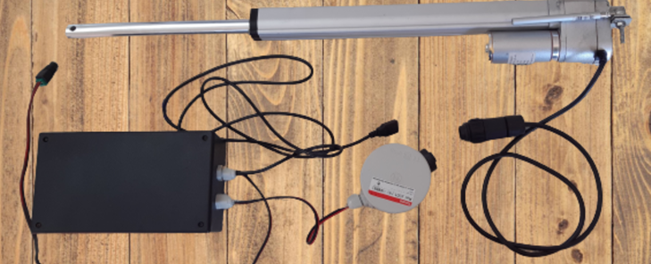

# Fenix Autopilot
Fenix Autopilot is an open-source DIY tiller pilot for small to medium boats based on Arduino using a smartphone to control and display. It provides connectivity to open source plotters.

Release documentation:
https://github.com/spascual90/Fenix/blob/master/RELEASE.md

## User Guide
https://spascual90.gitbook.io/fenix-autopilot/

## How to start with Fenix Autopilot?
First of all integrate your hardware.
Upload the SW to Arduino, the App to mobile and configure the autopilot parameters.

## HW integration
- Guide on how to integrate the components and build your Fenix autopilot
- Bill of materials: the basic shop list to build Fenix autopilot
- You can find all information in the web page:
https://fenix-autopilot.com/start-to-build-from-here
- Fritzing file for PCB production is available in Fenix PCB repository:
https://github.com/spascual90/PCB-for-Fenix/releases/latest

### IMU
- Sparkfun IMU ICM20948.This IMU has the best performance among all tested and is the only one currently supported. For calibration, Fenix_ICM_20948_Cal (Python application running on Windows/ Linux) is required.

### Linear actuator
- You can choose any linear actuator meeting minimum requirements: 12V with POT feedback. Recommended length: 300mm and speed: 30mm/seg

### Uploading SW to Arduino
You can find in HEX folder Xloader executable file, an application to upload HEX to Arduino.
You can find as part of this release HEX Arduino file.

### Installing Virtuino App
You can find in repository Virtuino-for-Fenix all elements required
- Enter into Play Store and install Virtuino Viewer
- Copy project file to the Virtuino folder in your mobile
- Configure Bluetooth

### Autopilot configuration
- All required settings and linear actuator calibration can be done using Fenix Virtuino App on your mobile.
- IMU Calibration requires to connect your laptop to Fenix autopilot USB and execution of python Fenix_ICM_20948_Cal (Python application running on Windows/ Linux).

## How to contribute?
Fenix Autopilot is an Open-source project. Source code can be found in Github,
https://github.com/spascual90/Fenix

Fenix Autopilot is developed in the frame of Fenix Project.
The goals of Fenix project are,
- to develop and test a prototype of open-source DIY navigation system for mini-cruisers.  
- to gather individual efforts to a joint solution.
- get users to adopt the system into their own boats with minimum technical knowledge.
All information in Fenix Project can be found here
https://fenix-autopilot.com/

## Developers: How to start?
### Installation of development environment
Install Sloeber, the Eclipse Arduino IDE https://eclipse.baeyens.it

Downlad Fenix Project from Github https://github.com/spascual90/Fenix

Compile and upload sketch to Arduino
