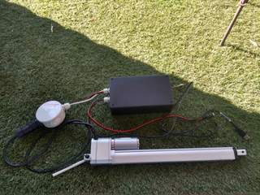
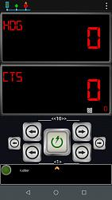

# Fenix Autopilot
Fenix Autopilot is an open-source DIY tiller pilot for small boats based on Arduino.

## Released versions
- V0.1 beta1 Initial version
- V0.1 beta2: Improves calibration information through App and NMEA I/F
- V2.0 beta1: Improves performance of Android App.  Compatible with Virtuino for Fenix V2.0
- V2.1 beta1: Provides additional information to CTS panel in Android App V2.1. Compatible with Virtuino for Fenix V2.0 and V2.1
- v.2.6.B1 implementation of capability to receive bearing from external IMU through HDM messages reception
- v.2.6.B1 implementation of capability to receive relative wind direction through VWR messages reception
- v.2.6.B2 IMU Calibration blocked in operational modes: IMU recalibration in ALL operational modes (not only STAND_BY)
- v.2.6.B2 IMU is not providing any value, keep previous value as the best approach
- v.2.6.B2 implementation of Wind Mode
- v.2.6.B2 Compatible with Virtuino for Fenix V3.0
- v.3.1.B1 Compatibility with Virtuino for Fenix App.4.1 (download Virtuino 6 App in Google Play Store) and retrocompatibility with Virtuino for Fenix App.3.0 (download Virtuino 5 App in Google Play Store)
- v.3.1.B1 Fix internal IMU issue in 2.6.B1 ( Internal IMU not working, external IMU ok)
- v.3.1.B1 Fix IMU recalibration in ALL operational modes: Fixes lost of autopilot operation when IMU recalibrates
- v.3.1.B1 Improved IMU validity data management. After 2 recalibrations w/o suceeding set STAND_BY
- v.3.1.B1 For developers: All config parameters into one file: Fenix_config.h
- v.3.2.B1 Autotune mode, proposes PID values based on boat performance test
- v.3.2.B1 Change of deadband min/MAX values: min: 1deg, max 5deg
- v.3.2.B1 Deadband mode button: select autodeadband mode (min, MAX, auto) from Virtuino for Fenix App.4.2
- v.3.2.B2 Heading deviation function is not applicable to External IMU
- v.3.2.B2 Fixed auto-calibration management
- v.3.2.B2 Deleted some debugging messages
- v.3.3B1 BNO055 IMU Library rebuilt. RTIMU open-source Library. 2 operational modes: internal or external fusion
- v.3.3B1 Additional IMU device available: Pololu MinIMU9V5
- v.3.3B1 VIRTUAL_ACTUATOR simulate rudder turn
- v.3.3B1 Fixed bug in NMEA DEC_COURSE_10 function
- v.3.3B1 Known limitations: 
- v.3.3B1 Known limitations: IMU must be installed: When IMU is not installed/found autopilot stops. It should raise a Warning and continue waiting for external compass information
- v.3.3B1 Known limitations: NMEA I/F: Centered Tiller Position and Heading alignment set parameter to 0 is not accepted
- v.3.4.B1 Additional IMU device available. Sparkfun 9DoF IMU Breakout - ICM-20948 (Qwiic) 
- v.3.4.B1 Known limitations:
- v.3.4.B1 Known limitations: Not compatible with BNO055
- v.3.4.B1 Known limitations: NMEA I/F: Centered Tiller Position and Heading alignment set parameter to 0 is not accepted

Release documentation:
https://github.com/spascual90/Fenix/blob/master/RELEASE.md

## User Guide
https://spascual90.gitbook.io/fenix-autopilot/

## How to contribute?
Fenix Autopilot is an Open-source project. Source code can be found in Github,
https://github.com/spascual90/Fenix

Fenix Autopilot is developed in the frame of Fenix Project.
The goals of Fenix project are,
- to develop and test a prototype of open-source DIY navigation system for mini-cruisers.  
- to gather individual efforts to a joint solution.
- get users to adopt the system into their own boats with minimum technical knowledge.
All information in Fenix Project can be found here
https://fenix-autopilot.com/

## How to start with Fenix Autopilot?
First of all integrate your hardware.
If you are a user, upload the SW to Arduino, the App to mobile and configure your autopilot.

If you are a developer, additionally you will have to setup a development environment.
## HW integration
- Guide on how to integrate the components and build your Fenix autopilot
- Build of materials: the basic shop list to build Fenix autopilot
- You can find all information in the web page:
https://fenix-autopilot.com/start-to-build-from-here
- Fritzing file for PCB production is available in Fenix PCB repository:
https://github.com/spascual90/PCB-for-Fenix/releases/latest

## Users: How to start?

### Selecting IMU
- Sparkfun IMU ICM20948.This IMU has the best performance among all and is recommended. For calibration, Fenix_ICM_20948_Cal (Python application running on Windows/ Linux) is required.
- Pololu MinIMU9V5. Calibration of this IMU is very simple and can be done with Fenix App (mobile phone). If you dont have computer skills is a good alternative.
- Adafruit BNO055 is discontinued by the supplier and available units have demostrate low reliability. May not be updated in versions after V3.3.

### Uploading SW to Arduino
You can find in HEX folder Xloader executable file, an application to upload HEX to Arduino.

You can find as part of this release HEX Arduino file.
Which HEX should I use?
- FenixVxxICM20948.hex: If you are using Sparkfun IMU ICM20948. Installed with components on top. 
- FenixVxxMinIMU9V5.hex: If you are using IMU Pololu MinIMU9V5. Installed with components on top. 
- FenixV33BNO055_Ext.hex: If you are using IMU BNO055. This HEX uses external algorith for tilt compass
- FenixV33BNO055_Int.hex: If you are using IMU BNO055. This HEX uses INTERNAL algorith for tilt compass
- SIMULATOR.hex: Simulates ship bearing and rudder. No IMU or linear actuator is required. For demo, development and testing purposes only

### Installing Virtuino App
You can find in repository Virtuino-for-Fenix all elements required
- Enter into Play Store and install Virtuino Viewer
- Copy project file to the Virtuino folder in your mobile
- Configure Bluetooth

### Autopilot configuration
- Connect your laptop to Fenix autopilot USB.
- Open Arduino IDE or putty.exe available in Serial IF folder
- In putty select the Arduino settings
- Open a new terminal
- Follow autopilot information to configure your IMU and linear actuator
- All implemented messages are described in Serial IF folder. A checksum calculator is included.
- Configure other parameters of the autopilot

## Developers: How to start?
### Installation of development environment
Install Sloeber, the Eclipse Arduino IDE https://eclipse.baeyens.it

Downlad Fenix Project from Github https://github.com/spascual90/Fenix

Compile and upload sketch to Arduino
