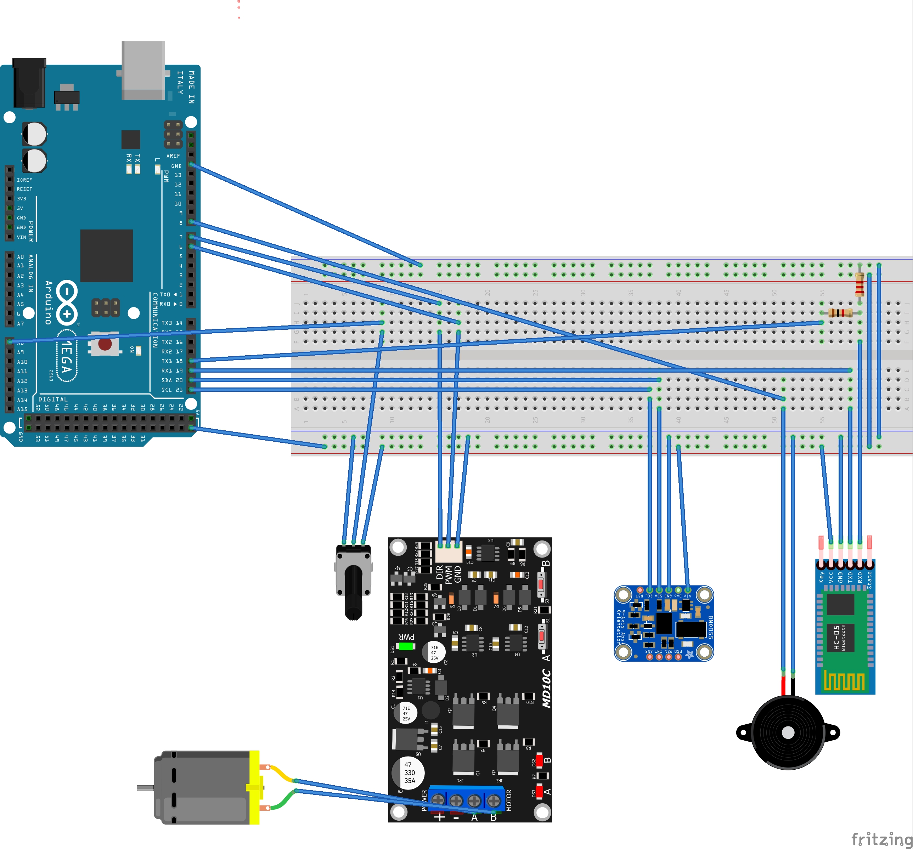

# Schematics

## Notes on Schematics & Bill of Materials
- Linear actuator with potenciometer is represented by,
  - M2 - DC Motor
  - R2	Rotary Potentiometer (Small)

- Alternative DC Motor Driver tested:
  - Cytron MD10C 10A 1 DC motor Driver
  - Cytron 10A 1 DC Motor Driver Arduino Shield

- DC motor driver is powered by a 12V battery not represented.
- Arduino can be powered by 12V battery using a step-down converter to at least 8.5V. Less tension will switch power source to USB leading Arduino to reset if current is too low (USB Laptop OK, Raspberry Pi USB NOK).
- Breaker at the 12V entry should be used for security.

## Notes on IMU BNO055
- I2C shall be connected to GND
- Shortcircuit S0 and S1 negative poles
- Install oscilator into available places

## Notes on HC-05 BT
- BT shall be configured to 38400 Bauds. Use BT_AT_Mode sketch

# Prototype assembly

