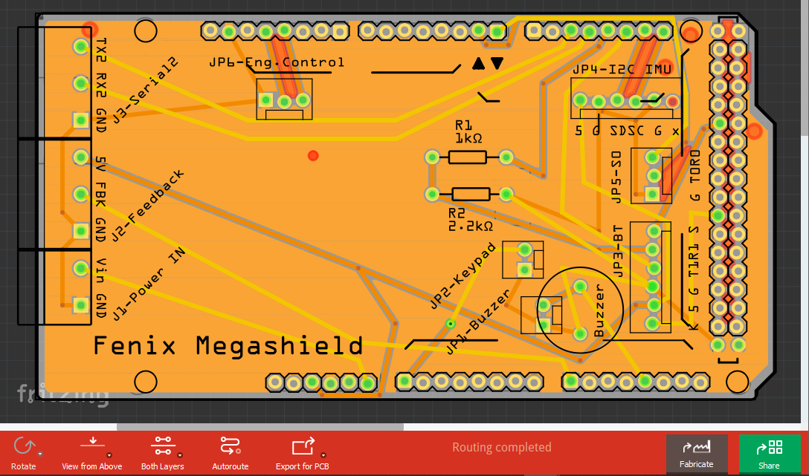
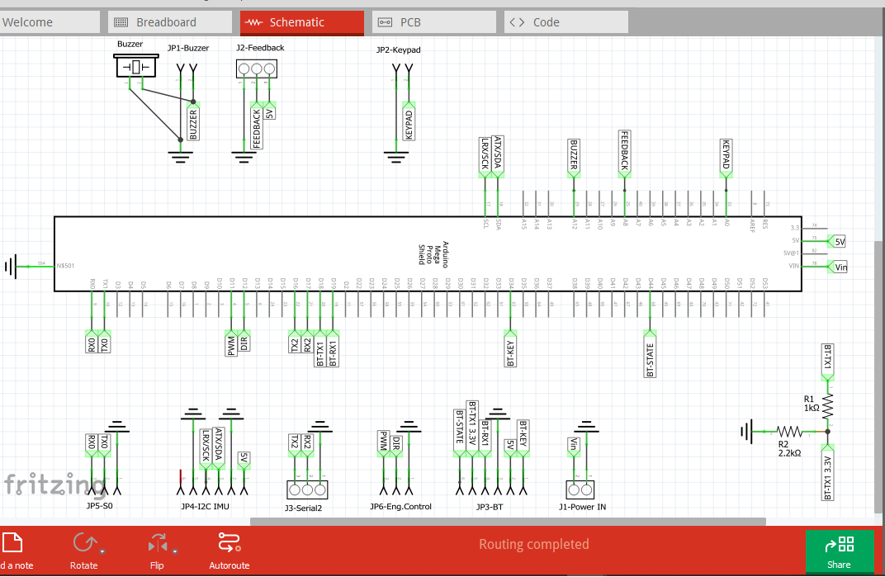

# Bill of Materials
1 x Arduino Mega R3
https://www.robotshop.com/en/arduino-mega-2560-microcontroller-rev3.html

1 x DC Motor driver. This shield requires to set the jumpers to the right PINS (D6 and D7)
https://www.robotshop.com/en/cytron-10a-dc-motor-driver-arduino-shield.html

1 x Linear actuator 12v 300mm with potenciometer 300N 27mm/s
https://es.aliexpress.com/item/33014366634.html?spm=a2g0s.9042311.0.0.274263c0mbz1Io

1 x IMU BNO055
Different integrations are available,
CJMCU-055 from Aliexpress and other cheap retailers tested and documented as part of this project:https://www.google.com/search?q=CJMCU-055
Alternative from Adafruit (not tested):https://www.adafruit.com/product/2472

1 x HC-05 Bluetooth module
https://tienda.bricogeek.com/modulos-bluetooth/800-modulo-bluetooth-hc-05.html?gclid=EAIaIQobChMI5emk172s6gIVg4XVCh2WrwZjEAQYAyABEgJ1zvD_BwE

1 x step-down converter
https://es.aliexpress.com/item/4000064597454.html?spm=a2g0o.productlist.0.0.1d127130KSvmyT&algo_pvid=e35c78d8-c997-4912-9ef5-beb706a51267&algo_expid=e35c78d8-c997-4912-9ef5-beb706a51267-26&btsid=0b0a01f815936238710315618ea24f&ws_ab_test=searchweb0_0,searchweb201602_,searchweb201603_

Fenix shield or Arduino megashield including,
- 1 x Fenix autopilot PCB
https://github.com/spascual90/PCB-for-Fenix

- 8 x Arduino stacking headers - 8 pins extra large (shorter pins might cause Fenix shield and Arduino PCB components touching each other and causing shortcuts)
https://www.sparkfun.com/products/9279

- 2 x Screw terminals 5.08mm pitch (distance between terminals), 0.8mm width of terminals: 2-pin and 3-pin
https://www.electronicaembajadores.com/en/Productos/Detalle/CTNA5102/connectors/pluggable-pcb-terminal-blocks/14-mm-pcb-terminal-block-5-08-mm-pitch-2-contacts-dg500-5-08-02p-14
https://www.electronicaembajadores.com/en/Productos/Detalle/CTNA5103/connectors/pluggable-pcb-terminal-blocks/14-mm-pcb-terminal-block-5-08-mm-pitch-3-contacts-dg500-5-08-03p-14
- 1 x Buzzer
https://es.aliexpress.com/item/32986141749.html?spm=a2g0s.9042311.0.0.793f63c0tr601Q

- 2 x Resistors: 1 Kohm & 2.2 Kohm

## Notes on Bill of Materials
- Linear actuator with potenciometer is represented by,
  - M2 - DC Motor
  - R2	Rotary Potentiometer (Small)

- Alternative DC Motor Driver tested:
  - Cytron MD10C 10A 1 DC motor Driver
  - Cytron 10A 1 DC Motor Driver Arduino Shield (Recomended with Fenix PCB)

- DC motor driver is powered by a 12V battery not represented.
- Arduino can be powered by 12V battery using a step-down converter to at least 8.5V. Less tension will switch power source to USB leading Arduino to reset if current is too low (USB Laptop OK, Raspberry Pi USB NOK).
- Breaker at the +12V entry should be used for security (Max. 10A recommended).

## Notes on IMU BNO055
Use of Fenix PCB provides necessary connections. If PCB is not used, I2C shall be connected to GND
- Shortcircuit S0 and S1 negative poles (soldering)
- Install crystal oscilator into available places

## Notes on HC-05 BT
- V2.0: BT standard baud rate. No configuration required.
- V0.1: BT shall be configured to 38400 Bauds. Use BT_AT_Mode sketch

# Autopilot assembly
## Fenix PCB V2.0-beta.1
This is based on PCB-Fenix Arduino shield.

## Fenix V.01 - Prototype assembly
This is based on Arduino MEGA prototyping shield.

